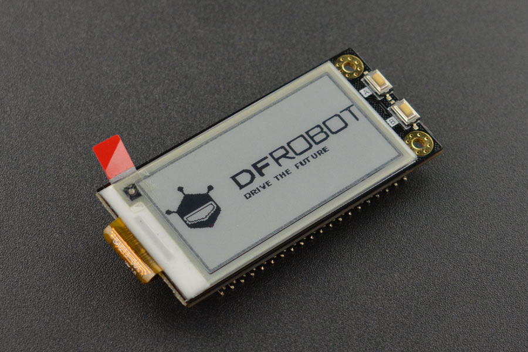

# DFRobot_RPi_Display_V2
- [English Version](./README.md)

这款树莓派墨水屏显示器模块，搭载一块2.13寸250×122分辨率电子墨水屏，采用SpI接口与树莓派通信。
该模块将树莓派的引脚引出，使用墨水屏的同时，不影响你使用树莓派引脚。该墨水屏可以自定义字体，
通过ttf文件可以定制宋体、楷体、黑体等多种字体。另外墨水屏显示器模块上增加两个贴片触摸开关，
方便扩展更多应用。该墨水屏体积小巧，布局紧凑，即插即用，具有低功耗，阳光下可清晰显示，
断电后保持最后一屏内容等特点。由于墨水屏全局刷新时间较长，不建议用于频繁动态刷新显示数据的场合。


## 产品链接（https://www.dfrobot.com.cn/goods-1961.html)
    DFR0238：树莓派4B/3B+/zero w 2.13英寸黑白墨水屏

## 目录

* [概述](#概述)
* [库安装](#库安装)
* [方法](#方法)
* [兼容性](#兼容性y)
* [历史](#历史)
* [创作者](#创作者)

## 概述

   1.在墨水屏上显示文字,位图,几何图形
   2.按键的控制


## 库安装
要使用库，首先下载到树莓派，然后打开例程文件夹。要执行例程demox.py，请在命令行上键入Python demox.py。
例如，demo_bitmap。Py例程，你需要输入:
```python
python demo_bitmap.py
```

## Methods

```python

  def flush(self, mode):
    '''!
      @fn flush
      @brief 把已经准备好的屏幕图像buffer发送出去,显示到墨水屏
      @param mode 显示的模式FULL:全屏刷新,PART:局部刷新
    '''

  def clearScreen(self):
    '''!
      @fn clearScreen
      @brief 清除墨水屏上显示的东西
    '''

  def color16to24(self, color):
    '''!
      @fn color16to24
      @brief RGB565转化为RGB888
      @return RGB888格式的数据
    '''

  def color24to16(self, color):
    '''!
      @fn color24to16
      @brief RGB888转化为RGB565
      @return RGB565格式的数据
    '''

  def setColorTo16(self):
    '''!
      @fn setColorTo16
      @brief 设置颜色数据格式为RGB565
    '''

  def setColorTo24(self):
    '''!
      @fn setColorTo24
      @brief 设置颜色数据格式为RGB888
    '''

  def setLineWidth(self, w):
    '''!
      @fn setLineWidth
      @brief 设置线段的宽度
    '''

  def setTextFormat(self, size, color, background, intervalRow = 2, intervalCol = 0):
    '''!
      @fn setTextFormat
      @brief 设置文本格式
      @param size 字体大小
      @param colo 字体颜色
      @param background 字体的背景色
      @param intervalRow 字体行之间的间隔
      @param intervalCol 字体列之间的间隔
    '''

  def setTextCursor(self, x, y):
    '''!
      @fn setTextCursor
      @brief 设置光标位置
      @param x x轴坐标
      @param y y轴坐标
    '''

  def setBitmapSize(self, size):
    '''!
      @fn setBitmapSize
      @brief 设置位图的尺寸
      @param size 位图的大小
    '''

  def setBitmapFmt(self, fmt):
    '''!
      @fn setBitmapFmt
      @brief 设置位图显示格式
      @param fmt 格式配置
    '''

  def setExFonts(self, obj):
    '''!
      @fn setExFonts
      @brief 设置字体
      @param fmt 字体
    '''

  def setExFontsFmt(self, width, height):
    '''!
      @fn setExFontsFmt
      @brief 设置字体的宽度和高度
      @param width 字体的宽度
      @param height 字体的高度
    '''
    
  def setEnableDefaultFonts(self, opt):
    '''!
      @fn setEnableDefaultFonts
      @brief 设置默认的字体
      @param opt 字体类型
    '''

  def pixel(self, x, y, color):
    '''!
      @fn pixel
      @brief 在屏幕(x,y)坐标处画一个点
      @param x x轴坐标
      @param y y轴坐标
    '''

  def clear(self, color):
    '''!
      @fn clear
      @brief 清理屏幕
      @param color 颜色
    '''

  def VLine(self, x, y, h, color):
    '''!
      @fn VLine
      @brief 画一条垂直线
      @param x x轴坐标
      @param y y轴坐标
      @param h 这条线的长度
      @param color 颜色
    '''

  def HLine(self, x, y, w, color):
    '''!
      @fn HLine
      @brief 画一条水平线
      @param x x轴坐标
      @param y y轴坐标
      @param w 这条线的长度
      @param color 颜色
    '''

  def line(self, x, y, x1, y1, color):
    '''!
      @fn line
      @brief 画一条直线
      @param x 直线的x轴起始坐标
      @param y 直线的y轴起始坐标
      @param x1 直线的x轴结束坐标
      @param x1 直线的y轴结束坐标
      @param color 颜色
    '''

  def triangle(self, x, y, x1, y1, x2, y2, color):
    '''!
      @fn triangle
      @brief 画一个空心三角形
      @param x 三角形第一个点的x坐标
      @param y 三角形第一个点的y坐标
      @param x1 三角形第二个点的x坐标
      @param x1 三角形第二个点的y坐标
      @param x1 三角形第三个点的x坐标
      @param x1 三角形第三个点的y坐标
      @param color 颜色
    '''

  def fillTriangle(self, x, y, x1, y1, x2, y2, color):
    '''!
      @fn fillTriangle
      @brief 画一个实心三角形
      @param x 三角形第一个点的x坐标
      @param y 三角形第一个点的y坐标
      @param x1 三角形第二个点的x坐标
      @param x1 三角形第二个点的y坐标
      @param x1 三角形第三个点的x坐标
      @param x1 三角形第三个点的y坐标
      @param color 颜色
    '''

  def rect(self, x, y, w, h, color):
    '''!
      @fn rect
      @brief 画一个空心矩形
      @param x 矩形起点x坐标
      @param y 矩形起点y坐标
      @param w 矩形宽度
      @param h 矩形高度
      @param color 颜色
    '''

  def fillRect(self, x, y, w, h, color):
    '''!
      @fn fillRect
      @brief 画一个实心矩形
      @param x 矩形起点x坐标
      @param y 矩形起点y坐标
      @param w 矩形宽度
      @param h 矩形高度
      @param color 颜色
    '''


  def circleHelper(self, x, y, r, quadrant, color):
    '''!
      @fn circleHelper
      @brief 画空心圆辅助函数
      @param x 圆心的x坐标
      @param y 圆心的y坐标
      @param r 半径
      @param quadrant 用来表示是哪一个四分之一圆
      @param color 颜色
    '''

  def circle(self, x, y, r, color):
    '''!
      @fn circle
      @brief 画一个空心圆
      @param x 圆心的x坐标
      @param y 圆心的y坐标
      @param r 半径
      @param quadrant 用来表示是哪一个四分之一圆
      @param color 颜色
    '''

  def fillCircleHelper(self, x, y, r, quadrant, color):
    '''!
      @fn fillCircleHelper
      @brief 画实心圆辅助函数
      @param x 圆心的x坐标
      @param y 圆心的y坐标
      @param r 半径
      @param quadrant 用来表示是哪一个四分之一圆
      @param color 颜色
    '''

  def fillCircle(self, x, y, r, color):
    '''!
      @fn fillCircle
      @brief 画一个空心圆
      @param x 圆心的x坐标
      @param y 圆心的y坐标
      @param r 半径
      @param quadrant 用来表示是哪一个四分之一圆
      @param color 颜色
    '''

  def roundRect(self, x, y, w, h, r, color):
    '''!
      @fn roundRect
      @brief 画一个空心的带圆角的矩形
      @param x 矩形起点x坐标
      @param y 矩形起点y坐标
      @param w 矩形宽度
      @param h 矩形高度
      @param r 圆角的半径
      @param color 颜色
    '''

  def fillRoundRect(self, x, y, w, h, r, color):
    '''!
      @fn fillRoundRect
      @brief 画一个实心的带圆角的矩形
      @param x 矩形起点x坐标
      @param y 矩形起点y坐标
      @param w 矩形宽度
      @param h 矩形高度
      @param r 圆角的半径
      @param color 颜色
    '''

  def bitmap(self, x, y, bitmap, w, h, color, background):
    '''!
      @fn bitmap
      @brief 画位图
      @param x  起点x坐标
      @param y  起点y坐标
      @param bitmap  位图数组
      @param w 位图的宽度
      @param h 位图的高度
      @param color 位图的颜色
      @param background 位图的背景色
    '''

  def startDrawBitmapFile(self, x, y):
    '''!
      @fn startDrawBitmapFile
      @brief 开始位图的绘制
      @param x  起点x坐标
      @param y  起点y坐标
    '''
  
  def bitmapFileHelper(self, buf):
    '''!
      @fn bitmapFileHelper
      @brief 位图绘制辅助函数
      @param buf  位图数组
    '''

  def endDrawBitmapFile(self):
    '''!
      @fn endDrawBitmapFile
      @brief 结束位图的绘制
    '''

  def bitmapFile(self, x, y, path):
    '''!
      @fn bitmapFile
      @brief 画位图
      @param x  起点x坐标
      @param y  起点y坐标
      @param path  位图文件所在的路径
    '''

  def writeOneChar(self, c):
    '''!
      @fn writeOneChar
      @brief 在墨水屏上显示一个字符
      @param c char类型的字符数据
    '''
```


## 兼容性


| 主板         | 通过 | 未通过 | 未测试 | 备注 |
| ------------ | :--: | :----: | :----: | :--: |
| RaspberryPi2 |      |        |   √    |      |
| RaspberryPi3 |      |        |   √    |      |
| RaspberryPi4 |  √   |        |        |      |

* Python 版本

| Python  | 通过 | 未通过 | 未测试 | 备注 |
| ------- | :--: | :----: | :----: | ---- |
| Python2 |  √   |        |        |      |
| Python3 |  √   |        |        |      |

## History

- 2022/03/11 - 1.0.0 版本


## Credits

Written by fengli(li.feng@dfrobot.com), 2022. (Welcome to our [website](https://www.dfrobot.com/))
